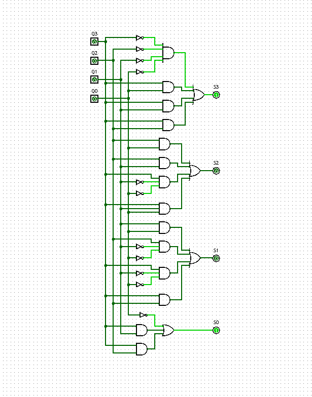

# Circuistos Digitais - Trabalho

Entrega do trabalho de Circuitos Digitais realizado pela dupla Thiago Nerton e Luana Teles.

Este README fornece informações sobre a atribuição, como configurar e executar o projeto, e detalhes adicionais.

## Sumário
- [Descrição](#descrição)
- [Seções do Circuito](#seções-do-circuito)
  - [Main](#main)
  - [Timer](#timer)
  - [Core](#core)
- [Utilização](#utilização)
- [Instalação](#instalação)
- [Contribuições](#contribuições)
- [Licença](#licença)

## Descrição

Sobre o jogo:
O "Guess the Number" com uma limitação de 15 pontos e um tempo máximo de 60 minutos é uma versão compacta e desafiadora do clássico jogo de adivinhação de números.

Objetivo:
Acertar o número secreto dentro de um intervalo específico, tudo isso em uma experiência que pode ser concluída em até 60 minutos.
O "Guess the Number" nesta versão é cativante pela sua natureza rápida e desafiadora. Oferece uma experiência intensa e gratificante, permitindo que os jogadores testem suas habilidades de dedução numérica em um curto espaço de tempo, tornando-o ideal para uma experiência de jogo envolvente e eficiente.

Funcionamento do jogo:
Os jogadores deverão determinar o tempo do jogo no cronómetro e apertar os botoes COMEÇAR E SELECT respectivamente. Apos isto o JOGADOR A deverá dar o seu primeiro palpite para a coordenada X, apertar os botões CHUTAR e SWAP_A respectivamente, e dar o seu palpite para a coordenada Y apertando por fim os botões CONFIRMAR, para confirmar seu chute, ALTERNAR JOGADOR, para trocar de jogador, e STOP, para começar o tempo do JOGADOR B, que deverá realizar os mesmos passos do JOGADOR A. Ganha quem fizer 15 pontos primeiro ou quem tiver mais pontos quando o tempo acabar.

## Seções

### Main


Aqui fica o jogo junto com as caixas dos sistemas do CORE e do TIMER.

### Timer
O TIMER (cronometro) funciona com 16 Flip-Flops tipo D, nos quais a cada 4 deles representa as unidades e dezenas de segundos e minutos, ligados a contadores de 9 a 0 e 5 a 0 e comparadores. Junto a isso, também utilizamos multiplexadores para auxiliar quando o pulso do clock deveria entrar nos Flip-Flops.


[^1]: Tabela verdade do contador de dezenas.


[^2]: Tabela verdade do contador de unidades.



### Core
No CORE é onde o jogo acontece. Nele é possível ver o INPUT_LOGIC que receberá os chutes dos jogadores e somará os mesmos, com a ajuda do INPUT_LOGIC_2 e do SOMADOR, o GERADOR DE NÚMEROS que dará os números a serem chutados, o COMPARADOR que irá comparar os números chutados com o número gerado e o CONTADOR, que irá mostrar quantos pontos cada jogador fez e quem ganhou. Além disso também é possível ver o sistema de mudança de relógio quando se passa de um jogador ao outro.


[^3]: Circuito input_logic, responsável por guardar os chutes e passar para o display.


[^4]: Circuito placar, capaz de guardar contagens até 15.


## Utilização

Usar a interface do main para interagir com o sistema e jogar.

## Instalação


```bash
# Comando de Instalação
git clone https://github.com/nerton1/Advinhe_o_Numero-Acentuado.git
cd Advinhe_o_Numero-Acentuado


